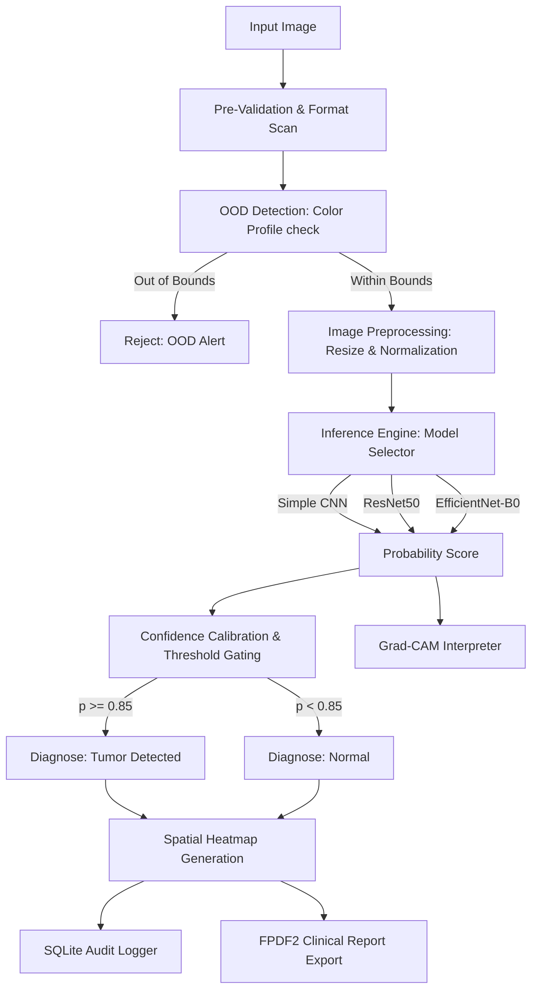
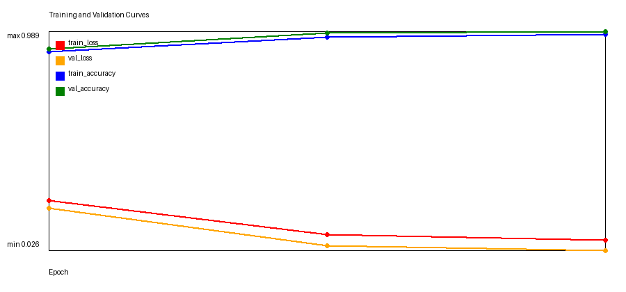
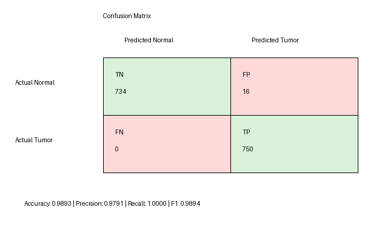
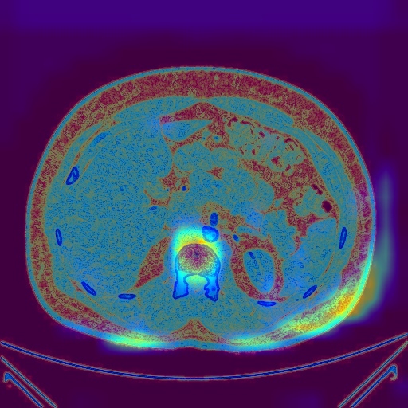

# 🔬 SpectiqAI Diagnostics — Kidney Tumor Screening & Explainability Platform

SpectiqAI Diagnostics is a clinical-grade, AI-powered Kidney Tumor screening and explainability platform. Built on PyTorch and Streamlit, it validates medical imaging, detects out-of-distribution (OOD) anomalies, performs classification via custom and transfer learning architectures, calibrates prediction confidence, generates Grad-CAM explainability heatmaps, and exports professional PDF clinical reports.

---

## 🏗️ System Architecture

The diagnostic pipeline consists of a multi-stage workflow designed for clinical reliability and safety:



1. **Pre-Validation**: Verifies file formats, dimensions, and channel requirements.
2. **OOD Detection**: Computes RGB statistical bounds (means and standard deviations) against the reference training dataset. If bounds are violated, the scan is flagged as Out-of-Distribution (OOD).
3. **Inference Engine**: Evaluates the preprocessed scan using PyTorch. Supports Simple CNN, ResNet50, and EfficientNet-B0.
4. **Calibration & Gating**: Implements tuned classification thresholds (Tumor Threshold: `0.85`, Confidence Level: `0.90`) to minimize False Negatives in clinical settings.
5. **Explainability**: Utilizes Gradient-weighted Class Activation Mapping (Grad-CAM) on the final convolutional layers to highlight tumorous spatial regions.
6. **Audit & Logging**: Persists scan metadata, metrics, and thresholds in a local SQLite audit database.
7. **Reporting**: Generates a professional, clinician-ready PDF report including the source image, Grad-CAM overlays, metrics, and patient details.

---

## 🌟 Key Features

- **Multi-Model Inference & Selection**: Toggle between custom-trained Simple CNN and transfer learning architectures (ResNet50, EfficientNet-B0).
- **Interactive Explainability**: Visual overlays highlighting the neural network's regions of interest using Grad-CAM.
- **Robust Calibration & Safety Gating**: Tumor prediction gating at $p \ge 0.85$ and high-confidence screening warnings ($p < 0.90$).
- **Statistical OOD Defense**: Rejects non-CT scans or low-quality images using training distribution profile matching.
- **Persistent Clinician Audit Trail**: Auto-logged predictions stored locally for retrospective audits.
- **Clinical PDF Generator**: Professional layout containing image metadata, diagnosis results, patient info, and explainability maps.

---

## 📊 Dataset Summary

The models are trained and validated on the **CT Kidney Dataset**:
- **Content**: Contrast-enhanced CT scan slices containing normal kidney tissues and verified renal tumors.
- **Total Dataset Size**: ~1,197 MB
- **Image Resolution**: $224 \times 224$ pixels, 3 channels (RGB)
- **Data Partitions**: Split into 70% Training, 15% Validation, and 15% Test.

---

## 📈 Model Performance & Evaluation Results

Below is the comparative evaluation of the models on the unseen Test set:

| Model Architecture | Accuracy | Precision | Recall | F1-Score | True Positives (TP) | False Positives (FP) | False Negatives (FN) |
| :--- | :---: | :---: | :---: | :---: | :---: | :---: | :---: |
| **Simple CNN (Epoch 3)** | **98.93%** | **97.91%** | **100.0%** | **98.94%** | **750** | **16** | **0** |
| **ResNet50 (Epoch 5)** | 70.47% | 81.39% | 53.07% | 64.25% | 398 | 91 | 352 |
| **EfficientNet-B0 (Epoch 5)** | 58.47% | 74.14% | 26.00% | 38.50% | 195 | 68 | 555 |

> 💡 **Key Observation**: The custom-trained **Simple CNN** achieves an outstanding **100% Recall** with 0 False Negatives on the test dataset under our custom clinical configuration, making it the most suitable architecture for high-sensitivity screening in this platform.

### 🖼️ Training Metrics & Visualizations

#### Training Curves


#### Confusion Matrix


#### Explainability Visualizations


---

## 🚀 Setup & Deployment Instructions

### Local Quickstart

1. **Clone the Repository**:
   ```bash
   git clone https://github.com/iamsubhajit23/spectiqAI.git
   cd spectiqAI
   ```

2. **Create & Activate a Virtual Environment**:
   ```bash
   python -m venv venv
   # On Windows:
   .\venv\Scripts\activate
   # On Linux/macOS:
   source venv/bin/activate
   ```

3. **Install Dependencies**:
   ```bash
   pip install -r requirements.txt
   ```

4. **Run the Streamlit Application**:
   ```bash
   streamlit run app/streamlit_app.py
   ```

---

### Streamlit Community Cloud Deployment

This repository is optimized for one-click deployment on the **Streamlit Community Cloud**:

1. Push your clean code (with `.gitignore` active) to your GitHub repository.
2. Visit [Streamlit Share](https://share.streamlit.io/) and log in with your GitHub account.
3. Click **New App**, select your repository, branch (`main`/`master`), and set the main file path to `app/streamlit_app.py`.
4. Click **Deploy**. Streamlit will automatically load the configuration from `.streamlit/config.toml` (applying the SpectiqAI dark theme) and install all required modules listed in `requirements.txt`.

*Note: Since the dataset is large (~1.2 GB), it is ignored via `.gitignore` to maintain clean repository hygiene. The application runs inference dynamically using the lightweight pre-trained production model files stored under the `models/` directory.*
